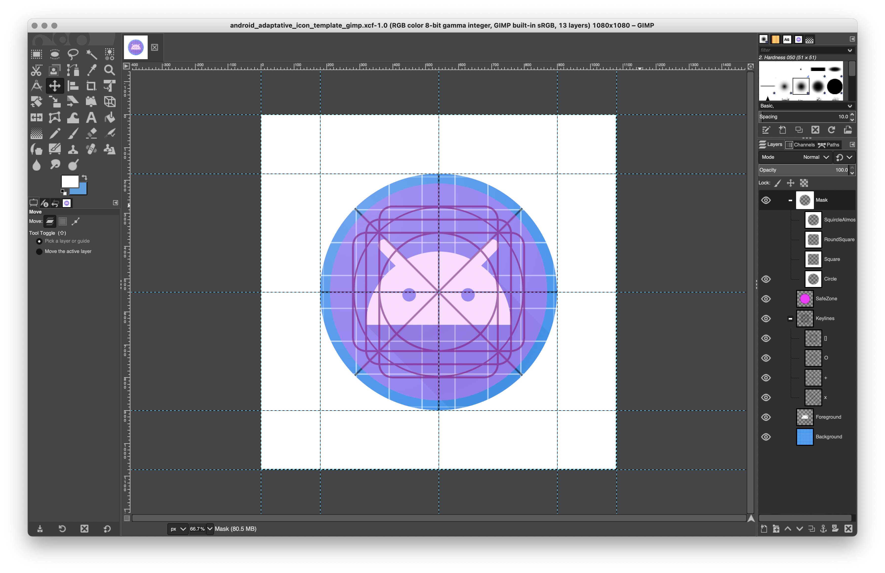

# Designing Adaptive Icons Template for GIMP

Hi, I'm a developer, no experience as designer, I just did follow [this guide](https://medium.com/google-design/designing-adaptive-icons-515af294c783) to create an adaptive icon template for GIMP as you can see on the following screenshoot.

## How to use

- The background layer and foreground layer are the more important, you need to export each one separately to use on your app
- Keylines and SafeArea are the important guidelines to follow.
- The masks are there just to help to understand how the icon looks like on real devices.
	
	
The circle, square and the rounded square masks are good enough in my opninion but the squircle is not looking like a the one from samsung, I did my best but I have no idea how to make it, the teardrop I didn't even try 😵

Hopefully it helps you 🙏